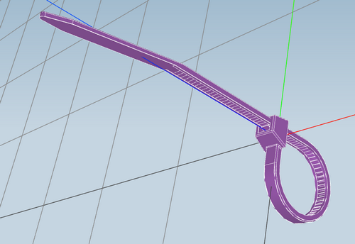

# README #

Software for Declarative CAD Feature Recognition — an efficient approach

### What is this repository for? ###

* v0.0.1
* [Learn More]()

### How do I get set up? ###

* Summary of set up
  
	1.npm install  
	2.set-env.bat  
	3.node install.js  
	4.cd node_modules/node-occ  
	5.npm install  
	6.cd ../..  
	7.node app.js  
	8.browse [http://localhost:3000/](http://localhost:3000/) and [http://localhost:3000/viewer](http://localhost:3000/viewer)  

* Steps of add c++ module

	1.cd ./src  
	2.add xxx.cc and xxx.h  
	3.modify install.js to add "copy('./xxx.cc', '../node_modules/node-occ/src/xxx.cc');"  
	4.modify install.js to add "copy('./xxx.h', '../node_modules/node-occ/src/xxx.h');"  
	5.modify binding.gyp to add xxx.cc and xxx.h to "sources" property  

* Steps of compile src

	1.cd ./src  
	2.node install.js  
	3.cd ../  
	4.set-evn.bat  
	5.node_modules/node-occ/  
	6.npm install  

* Configuration
* Dependencies

	you need [Microsoft Visual Studio 2012](http://www.microsoft.com/en-us/download/details.aspx?id=30682)  
	download and install [cmake](http://www.cmake.org/download/)  
	install node-js 32 bits version 0.12 from [www.nodejs.org](http://nodejs.org/dist/v0.12.0/node-v0.12.0-x86.msi)  

* Database build and install

	0.install all dependence. [Building with Visual C++ Requirements](http://www.postgresql.org/docs/devel/static/install-windows-full.html)  
	1.download postgresql [9.5.1](https://ftp.postgresql.org/pub/source/v9.5.1/postgresql-9.5.1.tar.bz2)  
	2.unzip to ./postgresql-9.5.1  
	3.node ./db/install.js  
	4.open "Developer Command Prompt for VS2012" cmder  
	5.cd ./postgresql-9.5.1/src/tools/msvc/  
	6.build.bat  
	7.install.bat ./path/to/install/  

* How to run tests

	1.browse [http://localhost:3000/viewer](http://localhost:3000/viewer).  
	2.Click 'Choose Files' to upload ./data/Cable Tie 2,5*100 MM.STEP  
	3.Check if the step file can render?  

	  

* Deployment instructions

### Todo List ###

* Bug list

	1.unkown entities problem.  

* SQL Callback

	1. create table r(edge int, face int)  
	2. create table ef(edge int, face1 int, face2 int)

### Contribution guidelines ###

* Writing tests
* Code review
* Other guidelines

### Who do I talk to? ###

* Repo owner or admin
* Other community or team contact